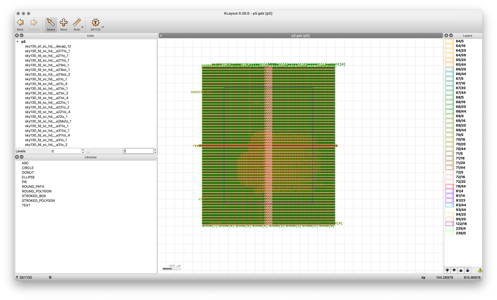

# Digital Circuit Design Projects with OpenLane

## Repository Overview

This repository contains a series of digital circuit designs implemented using Verilog and synthesized with the OpenLane flow using the Sky130 PDK (Process Design Kit). The projects demonstrate a progressive learning path - from basic digital circuits to complex CPU designs.



## Projects

### [P1: Two's Complement Calculator](p1/README.md)

A simple combinational circuit that implements an 8-bit two's complement operation, used for representing negative numbers in binary systems.

- **Features**: 8-bit I/O, combinational logic
- **Implementation**: Pure combinational logic with minimal area
- **View**: [Project Details](p1/README.md)
- **Screenshot**: [Layout](p1/screenshot.png)

### [P2: 8-bit ALU](p2/README.md)

An 8-bit Arithmetic Logic Unit that supports multiple operations including addition, subtraction, logical operations, and shifts.

- **Features**: 8 different operations controlled by a 3-bit opcode
- **Operations**: ADD, SUB, AND, OR, XOR, NOT, SHIFT LEFT, SHIFT RIGHT
- **Implementation**: Combinational circuit with case statement logic
- **View**: [Project Details](p2/README.md)
- **Screenshots**: [Design Layout](p2/image.png), [Alternate View](p2/image2.png)

### [P3: Zero-to-Five Counter](p3/README.md)

A sequential circuit that counts from 0 to 5 repeatedly, displaying the current count on a seven-segment display.

- **Features**: Clock-driven counter with reset functionality, seven-segment display output
- **Implementation**: Sequential logic with clock divider for one-second intervals
- **View**: [Project Details](p3/README.md)
- **Screenshots**: [Layout](p3/image.png), [Additional Views](p3/image2.png), [Seven-Segment Display](p3/image3.png)

### [P4: Register File & ALU Design](p4/README.md)

An integrated design featuring a 32-bit register file and ALU, forming the core components of a basic CPU datapath.

- **Features**: 32 general-purpose registers, 4-operation ALU (ADD, SUB, SHIFTL, SHIFTR)
- **Implementation**: Modular design with register file and ALU components
- **View**: [Project Details](p4/README.md)
- **Screenshot**: [Layout](p4/image.png)

### [P5: Single-Cycle CPU Core](p5/README.md)

A simplified single-cycle CPU implementation with basic RISC-type instruction execution capabilities.

- **Features**: Complete datapath including program counter, instruction memory, register file, ALU, and control logic
- **Implementation**: Single-cycle architecture with manual control via button input
- **View**: [Project Details](p5/README.md)
- **Screenshot**: [Layout](p5/image.png)

### [P6: Enhanced Single-Cycle CPU Core](p6/README.md)

An enhanced version of P5 that includes advanced control flow capabilities and improved signal processing.

- **Features**: Support for branch/jump instructions, improved debounce circuit, extended instruction set
- **Implementation**: Enhanced single-cycle architecture with robust button debouncing
- **View**: [Project Details](p6/README.md)
- **Screenshot**: [Layout](p6/image.png)

## Implementation Details

All designs were implemented using:

- **HDL Language**: Verilog
- **Synthesis Flow**: OpenLane
- **PDK**: SkyWater SKY130 (130nm)
- **Layout Tool**: Magic VLSI
- **Verification**: Various simulation and static timing analysis tools

## Project Structure

Each project directory contains:

1. **Source Files**: Verilog implementation files in the `src` directory
2. **Configuration**: `config.json` file for the OpenLane flow
3. **Pin Configuration**: `pin_order.cfg` for pin placement
4. **Run Results**: Complete synthesis, place & route results in the `runs` directory
5. **GDS Files**: Final GDS files for physical implementation (where applicable)
6. **Documentation**: README.md with project-specific details
7. **Visual Resources**: Screenshots and images showing the design layout

## Getting Started

To work with these designs:

1. Clone this repository
2. Install OpenLane and the SKY130 PDK following [official instructions](https://github.com/The-OpenROAD-Project/OpenLane)
3. Navigate to a specific project directory
4. Run the OpenLane flow:
   ```
   cd /path/to/OpenLane
   make mount
   ./flow.tcl -design /designs/[project_name]
   ```

## Educational Value

This repository serves as an educational resource for:

- Learning progressive VLSI design concepts
- Understanding digital circuit implementation from basic to complex
- Exploring OpenLane-based ASIC design flow
- Gaining hands-on experience with industry-standard EDA tools
