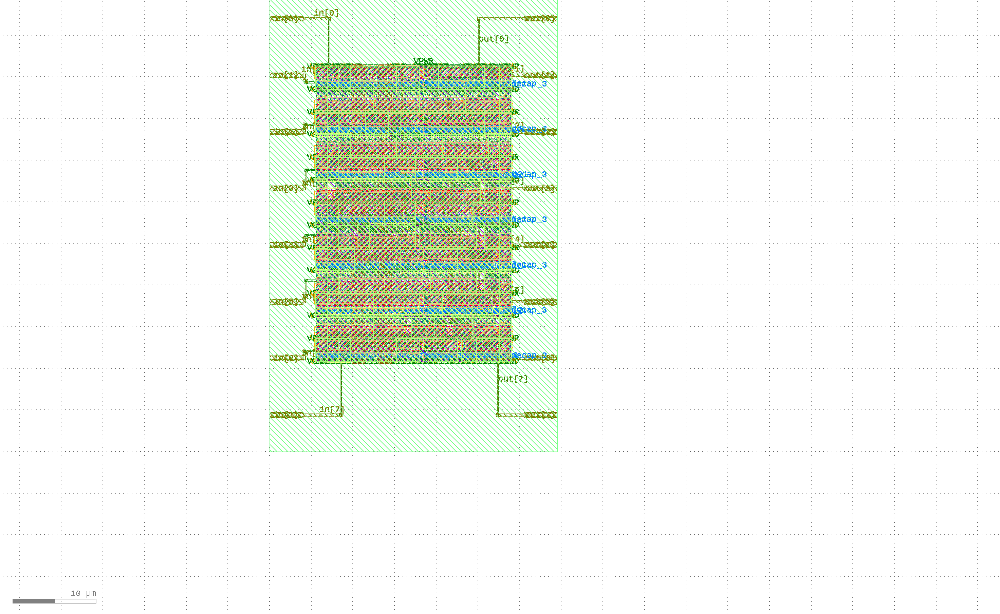

# Two's Complement Calculator (P1)

## Project Overview

This project implements a simple but fundamental digital circuit: a two's complement calculator. The design converts an 8-bit binary input to its two's complement representation, which is a mathematical operation commonly used in digital systems for representing negative numbers.

## Functionality

The two's complement of a binary number is calculated by:
1. Inverting all bits (changing 0s to 1s and vice versa)
2. Adding 1 to the result

This operation is implemented in a single line of Verilog code:
```verilog
assign out = ~in + 1;
```

## Features

- **8-bit Input/Output**: Processes 8-bit binary numbers
- **Combinational Logic**: Pure combinational circuit with no clock requirements
- **Simple Implementation**: Minimal gate count for efficient area usage
- **Pin Configuration**: Input pins on west side, output pins on east side

## Physical Implementation Layout



## Implementation Details

The design was synthesized, placed and routed using the OpenLane flow with the Sky130 PDK. The implementation includes:

- Die Area: 34.5 x 57.12 µm
- Target Density: 0.75
- Core Utilization: 45% (for Sky130)
- No clock tree (combinational logic only)

## Applications

Two's complement is essential in digital systems for:
- Representing negative numbers in binary
- Performing subtraction using addition circuits
- Handling signed arithmetic in processors
- Simplifying ALU designs

## Technical Specifications

- Technology: SKY130 (130nm)
- Design optimization: Area focused
- Power Domains: Single power domain
