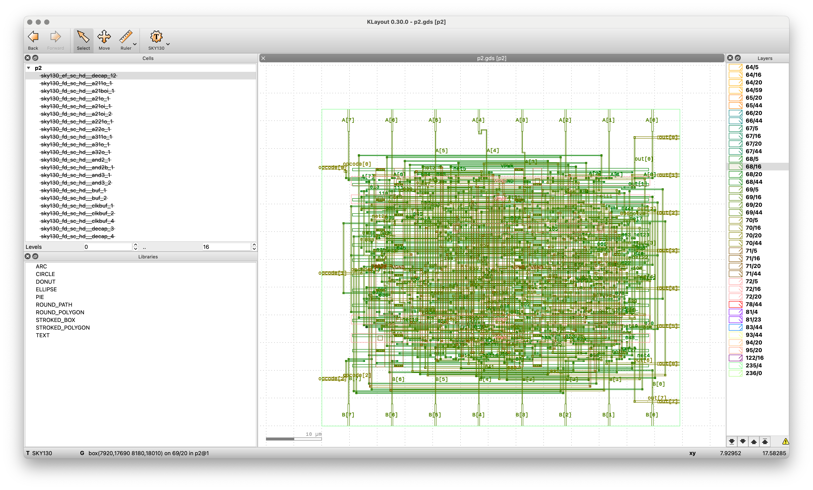

# 8-bit Arithmetic Logic Unit (ALU)

## Overview

This project implements an 8-bit Arithmetic Logic Unit (ALU) in Verilog. The ALU performs various arithmetic and logical operations on two 8-bit inputs based on a 3-bit operation code.

## Functionality

The ALU module (`p2`) takes two 8-bit inputs (`A` and `B`), a 3-bit operation code (`opcode`), and produces an 8-bit output (`out`). The output depends on the operation selected by the opcode.

## Interface

| Signal | Direction | Width | Description |
|--------|-----------|-------|-------------|
| A      | Input     | 8-bit | First operand |
| B      | Input     | 8-bit | Second operand |
| opcode | Input     | 3-bit | Operation selector |
| out    | Output    | 8-bit | Result of the operation |

## Operations

| opcode | Operation | Description |
|--------|-----------|-------------|
| 000    | A + B     | Addition |
| 001    | A - B     | Subtraction |
| 010    | A & B     | Bitwise AND |
| 011    | A \| B    | Bitwise OR |
| 100    | A ^ B     | Bitwise XOR |
| 101    | ~A        | Bitwise NOT (complement) |
| 110    | A << 1    | Logical left shift by 1 |
| 111    | A >> 1    | Logical right shift by 1 |

## Implementation Details

The ALU is implemented using a case statement that selects the appropriate operation based on the opcode. The result is continuously updated (combinational logic) whenever any of the inputs change.

```verilog
always @(*) begin
    case (opcode)
        3'b000: out = A + B;         
        3'b001: out = A - B;         
        3'b010: out = A & B;         
        3'b011: out = A | B;         
        3'b100: out = A ^ B;         
        3'b101: out = ~A;            
        3'b110: out = A << 1;        
        3'b111: out = A >> 1;        
        default: out = 8'b00000000;  
    endcase
end
```

## Synthesis and Layout Results

Below are the images showing the synthesized circuit layout for this ALU implementation:




## Usage Example

```verilog
// Instantiate the ALU
p2 alu_inst (
    .A(a_reg),          // Connect to an 8-bit register
    .B(b_reg),          // Connect to an 8-bit register
    .opcode(op_select), // Connect to a 3-bit operation selector
    .out(result)        // Connect to an 8-bit result register
);
```

## Directory Structure

```
/designs/p2/
├── src/
│   └── ALU.v           # The ALU implementation file
├── test/               # Test bench files (if any)
└── README.md           # This file
```
