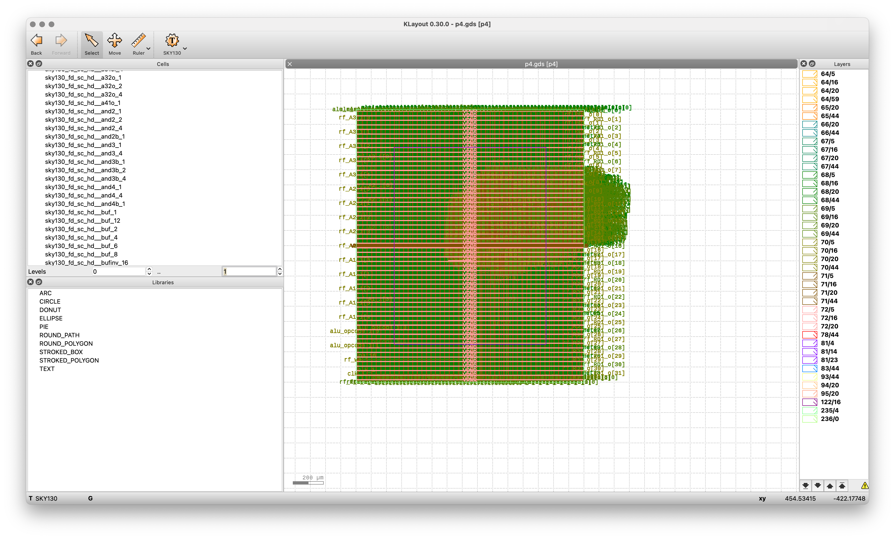

# 7-Segment Counter (p3)

## Overview

This project implements a simple 7-segment counter that counts from 0 to 5 using the Sky130 PDK and OpenLane flow.

## Functionality

- Counts from 0 to 5, displaying the count on a 7-segment display
- Updates once per second (with 100MHz clock)
- Resets to 0 when counter reaches 5
- Uses only the leftmost display (AN[0])



## Implementation

- Die area: 64.5 μm × 57.12 μm
- Synthesized with Sky130 standard cells


## Usage

To use this counter in your design:

```verilog
p3 counter_instance (
    .clk(clock_signal),
    .rst(reset_signal),
    .seg(segment_outputs),
    .an(anode_outputs)
);
```

## Display Patterns

The 7-segment display patterns (active low):
- 0: `1000000`
- 1: `1111001`
- 2: `0100100`
- 3: `0110000`
- 4: `0011001`
- 5: `0010010`
