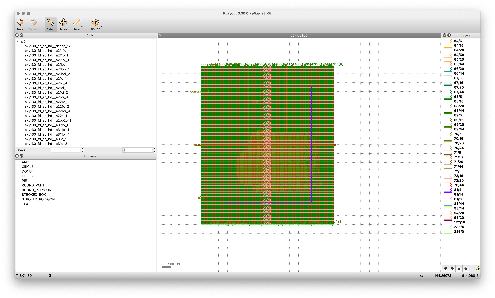

# Single-Cycle CPU Core Implementation (P5)

## Project Overview

This project implements a simplified single-cycle CPU core with basic RISC-type instruction execution capabilities. The design features a complete data path including program counter, instruction memory, register file, ALU, and control logic.

## Architecture

The CPU implements a simplified RISC architecture with the following components:

- **Program Counter**: Maintains the current instruction address
- **Instruction Memory**: Stores the program instructions
- **Instruction Decoder**: Generates control signals based on instruction type
- **Register File**: 32 general-purpose registers with dual read ports and single write port
- **Extend Unit**: Sign-extends immediate values from instructions
- **ALU**: Performs arithmetic and logical operations
- **Seven-Segment Display Controller**: Displays ALU result output

## Features

- Support for basic instruction types
- Manual instruction stepping via control button
- Reset functionality
- ALU operations display on 7-segment displays
- Single-cycle execution model
- Hardware implementation of control and data paths

## Diagram



## Physical Implementation

The design was synthesized, placed and routed using the OpenLane flow with the Sky130 PDK. The implementation includes:

- Die Area: 1500 x 1800 µm
- Core Utilization: 20%
- Target Density: 0.2
- Clock Period: 10 ns

## Module Hierarchy

```
p5 (semi_cpu_top)
├── program_counter
├── instruction_memory
├── instruction_decoder
├── register_file
├── extend_unit
├── alu
└── seven_seg_controller
```

## Technical Specifications

- Clock frequency: 100 MHz
- Power Domain: Single power domain
- Technology: SKY130 (130nm)
- Design optimization: Area and power focused
