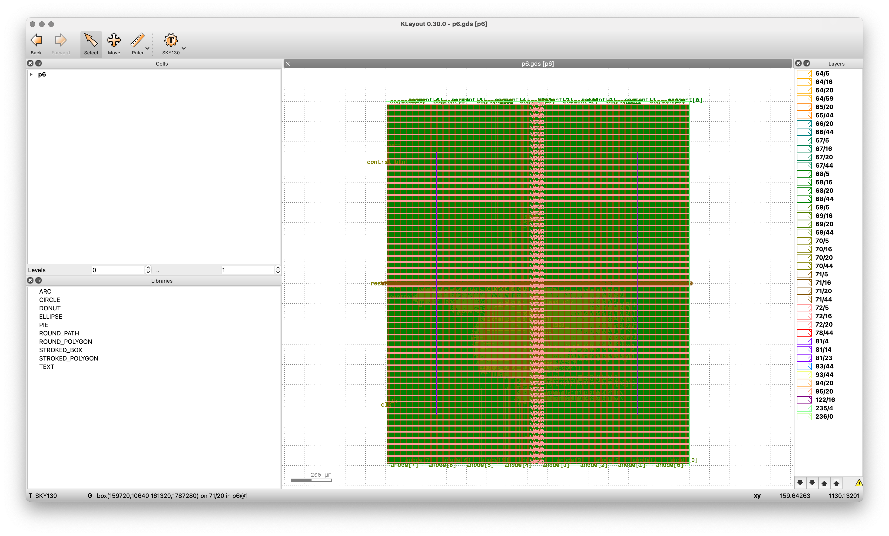

# Enhanced Single-Cycle CPU Core (P6)

## Project Overview

This project builds upon P5 to implement an enhanced single-cycle CPU with extended instruction support, improved control flow capabilities, and robust signal processing for reliable operation.

## Architecture Improvements

The enhanced CPU architecture builds on the previous design with the following additions:

- **Advanced Control Flow**: Support for branch and jump instructions
- **Improved Debouncer Circuit**: Enhanced button debouncing for reliable manual operation
- **Extended Instruction Set**: Additional instruction formats supported
- **Computed Target PC**: Dynamic program counter calculation for branching operations
- **Enhanced ALU**: Support for comparison operations with zero flag

## Features

- Support for I-type, R-type, B-type, and J-type instructions
- Hardware-based debounce and pulse generation for reliable button input
- Branch and jump execution capabilities
- Manual instruction stepping with clean signal processing
- Reset functionality with debouncing
- ALU results visible on 7-segment display
- Single-cycle execution model with extended functionality

## Diagram



## Physical Implementation

The design was synthesized, placed and routed using the OpenLane flow with the Sky130 PDK. The implementation includes:

- Die Area: 1500 x 1800 µm
- Core Utilization: 20%
- Target Density: 0.2
- Clock Period: 10 ns

## Module Hierarchy

```
p6 (semi_cpu_top)
├── program_counter (enhanced)
├── instruction_memory
├── instruction_decoder (enhanced)
├── register_file
├── extend_unit
├── alu (enhanced)
└── seven_seg_controller
```

## Technical Specifications

- Clock frequency: 100 MHz
- Power Domain: Single power domain
- Technology: SKY130 (130nm)
- Design optimization: Area and power focused
- Button debounce time: ~0.5ms at 100MHz clock
